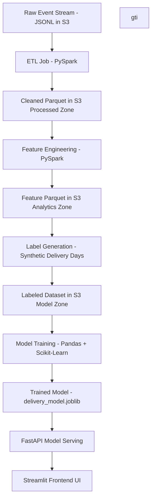

<!-- COVER BANNER -->
<p align="center">
  
</p>

<p align="center">
  
  
  
  
  
  
</p>

---

## Delivery Time Prediction Pipeline

This project predicts **package delivery time (in days)** using an end-to-end ML & Data Engineering pipeline.  
It simulates real warehouse → shipping → delivery operations using:

- **PySpark ETL**
- **Feature Engineering pipeline**
- **Synthetic label generation**
- **Scikit-Learn model training**
- **FastAPI prediction service**
- **Streamlit UI**

The goal is to demonstrate:
- Real ETL + Analytics layers  
- Full ML workflow  
- Model serving + UI in a clean production-style structure

---

##  Tech Stack

### Data Engineering
- PySpark
- S3 Data Lake (raw → processed → analytics → model zones)
- Parquet columnar storage

### Machine Learning
- Pandas
- NumPy
- Scikit-Learn
- Joblib model serialization

### APIs & UI
- FastAPI backend
- Uvicorn server
- Streamlit UI
 
---

## 📦 Architecture Overview


---

#  Features

### **✔ Real-time stream simulation**
Simulates 1 shipment event per second.

### **✔ Spark ETL Layer**
- Cleans raw data  
- Handles schema variations  
- Writes processed Parquet to S3  

### **✔ Feature Engineering**
Includes:
- weight buckets  
- timestamp splitting  
- customer zip proxy distance  
- binary flags  
- categorical encoding  

### **✔ Synthetic Label Generation**
Creates realistic **delivery_days** for ML training.

### **✔ Machine Learning Model**
Trains:
- Linear Regression  
- Decision Tree  
- Random Forest  

Automatically selects best model using:
- MAE  
- RMSE  
- R²  

### **✔ FastAPI model inference**
POST `/predict` returns delivery time.

### **✔ Streamlit Interface**
A simple UI for business users to test predictions.

---

## Model Performance

Three different models were trained and compared using the engineered dataset:

- **Linear Regression**
- **Decision Tree Regressor**
- **Random Forest Regressor**

### Evaluation Metrics Used
| Metric | Meaning |
|--------|---------|
| **MAE** (Mean Absolute Error) | Average absolute difference between prediction and real value |
| **RMSE** (Root Mean Squared Error) | Penalizes large mistakes → important for delivery-time prediction |
| **R² Score** | Measures how well the model explains variance (1.0 = perfect) |

---

## Model Comparison

| Model | MAE ↓ | RMSE ↓ | R² ↑ | Notes |
|-------|-------|--------|------|-------|
| **Linear Regression** | **0.228** | **0.280** | **~1.00** | Best performance + stable |
| Decision Tree | 25.167 | 29.158 | ~1.00 | Overfitting heavily |
| Random Forest | 2.444 | 3.304 | ~1.00 | Strong model but more complex |

---

## Selected Model: **Linear Regression**

### ✔ Why Linear Regression?
- Best **MAE** and **RMSE** (very low error)
- Very fast to train (good for pipelines)
- Easy to interpret → preferred in logistics & supply chain
- Small model size (perfect for API deployment)
- Performs well because:
  - delivery_days is mostly linear (weight ↑ → delivery time ↑)
  - engineered features capture the non-linear parts

---

# Project Structure
```

delivery-prediction-pipeline/
│
├── data_lake/
│ ├── raw/
│ ├── processed/
│ ├── analytics/
│ └── model/
│
├── models/
│ ├── delivery_model.joblib
│ └── model_metrics.json
│
├── src/
│ ├── api/
│ │ ├── app.py
│ │ ├── predict_utils.py
│ │ └── init.py
│ │
│ ├── ui/
│ │ ├── streamlit_app.py
│ │ └── init.py
│ │
│ ├── jobs/
│ │ ├── etl_job.py
│ │ ├── feature_engineering.py
│ │ ├── label_generation.py
│ │ ├── run_spark_etl.py
│ │ ├── run_feature_engineering.py
│ │ ├── run_label_generation.py
│ │ ├── run_model_training.py
│ │ ├── order_producer.py
│ │ └── order_consumer.py
│ │
│ ├── config/
│ │ ├── spark_config.py
│ │ └── settings.py
│ │
│ └── utils/
│ ├── helpers.py
│ └── init.py
│
├── logs/
├── requirements.txt
└── README.md
```

---

# Installation

### 1. Clone Repo
```bash
git clone https://github.com/RaghuramReddy9/delivery-prediction-pipeline.git
cd delivery-prediction-pipeline
```
### 2. Create Virtual Environment
```bash
python -m venv .venv
.venv\Scripts\activate
```
### 3. Install Requirements
```bash
pip install -r requirements.txt
```
---
# Running the Pipeline

### 1. Run Spark ETL
```bash
python src/jobs/run_spark_etl.py
```
### 2. Run Feature Engineering
```bash
python src/jobs/run_feature_engineering.py
```
### 3. Generate Labels
```bash
python src/jobs/run_label_generation.py
```
### 4. Train ML Model
```bash
python src/jobs/run_model_training.py
```

---
## 🌐 API Service (FastAPI)

The project exposes a lightweight prediction API using **FastAPI**.

### How it works
1. User submits shipment information (`warehouse`, `weight`, `carrier`, etc.)
2. The API:
   - Applies the same feature engineering used during training
   - Loads the trained model (`delivery_model.joblib`)
   - Returns predicted delivery time (in days)

### API Endpoint

#### `POST /predict`

**Request Body**
```json
{
  "order_id": "O1001",
  "warehouse": "NEW_YORK",
  "customer_zip": "95123",
  "weight_kg": 3.5,
  "carrier": "UPS",
  "event_time": "2025-11-21T11:30:00"
}
```
---

## Run the FastAPI Backend
```bash
uvicorn src.api.app:app --reload
```
Open interactive docs:

👉 http://127.0.0.1:8000/docs

---

## Run the Streamlit User Interface
```bash
streamlit run src/ui/streamlit_app.py
```

---

## Example Prediction Request
```bash
curl -X POST "http://127.0.0.1:8000/predict" \
-H "Content-Type: application/json" \
-d '{
  "order_id": "T1001",
  "weight_kg": 4.8,
  "customer_zip": "91345",
  "carrier": "UPS",
  "warehouse": "NEW_YORK",
  "event_time": "2025-11-18T13:00:00"
}'
```
---
## Model Metrics (Example)
```json
{
  "MAE": 0.22,
  "RMSE": 0.28,
  "R2": 0.9999
}
```
---
## 📦 Dataset Overview

The dataset is generated from a synthetic shipment stream and stored in S3.

### Data Zones
| Zone | Description |
|------|-------------|
| `raw/` | Incoming shipment events (JSONL) |
| `processed/` | Cleaned & validated records (Parquet) |
| `analytics/` | Engineered features for ML |
| `model/` | Final training dataset with labels |

### Raw Event Sample
```json
{
  "order_id": "O1234",
  "warehouse": "NEW_YORK",
  "customer_zip": "95123",
  "weight_kg": 3.4,
  "carrier": "UPS",
  "event_time": "2025-11-20T09:15:54"
}
```
---

# Author

Raghuramreddy Thirumalareddy

Machine Learning & GenAI Engineer

GitHub: https://github.com/RaghuramReddy9
LinkedIn: https://www.linkedin.com/in/raghuramreddy-ai/


